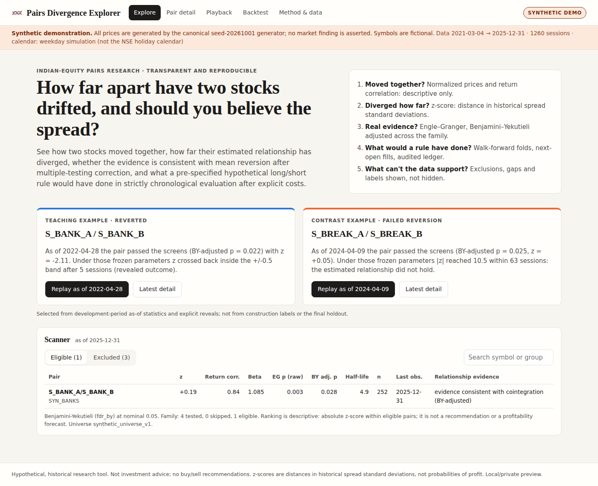

# Pairs Divergence Explorer

An interactive, reproducible research application for **pairs of Indian equities**. It answers five questions honestly:

1. How have these two stocks moved together? (normalized prices, return correlation, drawdowns: descriptive only)
2. How far has their estimated relationship diverged? (spread z-score in historical standard deviations)
3. Is the evidence consistent with mean reversion? (Engle–Granger, Benjamini–Yekutieli-adjusted across the candidate family, half-life)
4. What would a pre-specified hypothetical long/short rule have done? (walk-forward folds, next-open fills, audited cash/position ledger, explicit costs, holdout kept separate)
5. Which observations are trustworthy, and what can't the data support? (data-quality report, exclusion reasons, mode labels)

> **Current source mode: `SYNTHETIC_DEMO`.** All prices shown by default are generated by the canonical seed-20261001 generator. No market
> finding is asserted. Real NSE data has **not** been retrieved or validated in this build (see [REAL_DATA_READINESS.md](REAL_DATA_READINESS.md)).
> This is a local/private research preview. It has not been deployed publicly. It is not investment advice.



## Start (one command)

Requirements: Python 3.12 with [uv](https://docs.astral.sh/uv/) (or plain `venv` + pip), Node.js 22 LTS + npm (only to build the UI once).

| Platform | Command |
|---|---|
| Linux / macOS | `make demo` or `./start_demo.sh` |
| Windows (PowerShell) | `./start_demo.ps1` |
| Any (after `uv sync`) | `uv run python scripts/launcher.py` |

The launcher builds the frontend if needed, picks a free port starting at 8000, binds to **127.0.0.1**, prints the actual URL, and cleans
up child processes on Ctrl+C. No keys, no database setup and no Docker are needed. Tested URL in the build environment:
`http://127.0.0.1:8765` (`make check-start`) and `http://127.0.0.1:8800` (UI inspection).

Other commands:

| Command | What it does |
|---|---|
| `make setup` | `uv sync` + `npm ci` from lockfiles |
| `make doctor` | tools, versions, config, writable cache paths, provider status (no secrets printed) |
| `make test` | pytest suite (80 tests) + Playwright critical flow (desktop + 390 px mobile) |
| `make build` | production UI build + backend import/config validation |
| `make refresh` | explicit, bounded NSE MCP discovery + small validation sample; never runs at startup |
| `make dev` | backend + Vite dev server with hot reload |
| `make generate` | regenerate `data/demo/canonical_demo.csv` from the canonical generator |
| `docker compose up --build` | optional container route on 127.0.0.1:8000 (**not verified here: no Docker daemon**) |

## Views

* **Explore**: curated teaching example (reverted) and contrast example (failed reversion), selected algorithmically from development-period
  as-of statistics; searchable scanner with eligible and excluded tabs, raw and BY-adjusted p-values, and an honest empty state.
* **Pair detail**: z-score with bands, normalized prices, rolling correlation, log spread, walk-forward point-in-time z, diagnostics
  (EG statistic, critical values, ADF/KPSS, β history and stability warnings), deterministic explanation, "what changed?", and PNG card export.
* **Playback**: pick any as-of date; everything is refit on the trailing 252 sessions. The future is shown only after an explicit reveal, in a
  visually separate panel, and is hidden again when the date moves.
* **Backtest**: editable assumptions (non-default runs are labelled exploratory and logged), fold diagram, equity vs zero-friction/long-only/cash,
  drawdown, development vs final-holdout results, cost stress table, trades, fill ledger, and a reproducible `.zip` run bundle.
* **Method & data**: equations, timing, statuses, provider diagnostics, experiment counts, limitations.

URLs are stable and shareable, for example `/?view=playback&a=S_BREAK_A&b=S_BREAK_B&asof=2024-04-09`.

## Repository layout

```
backend/app/        config, providers (synthetic/file/nse_mcp), validation, analytics, backtest, explanations, api, card, gate, registry
frontend/           React + TypeScript + Vite + Plotly UI, Playwright e2e
tests/              pytest: oracles, no-lookahead, statistics reference, validation, providers, gate, API, reproducibility
config/             research defaults, universes, display policy, NSE mapping (versioned)
data/demo/          canonical synthetic dataset + manifest (sha256 f08153e9…cd7)
data/provider_snapshots/  NSE discovery/health snapshots and refresh log (redacted)
docs/screenshots/   desktop + mobile screenshots actually rendered in this environment
scripts/            launcher, doctor, refresh, generate, reproduce_run
```

## Tested versions

Python 3.12.3, numpy 2.5.3, pandas 3.0.6, scipy 1.18.1, statsmodels 0.15.0, duckdb 1.5.6, pyarrow 25.0.1, fastapi 0.142.2,
pydantic 2.13.5, matplotlib 3.11.2, mcp 2.2.0 (`uv.lock`, `requirements.lock`); Node 22.22.0, React 19.3.0, Vite 8.3.2, TypeScript 7.0.2,
plotly.js-dist-min 4.1.1, @playwright/test 1.63.0 with Chromium 141 (`frontend/package-lock.json`). Supported platforms: Linux (tested);
macOS and Windows via the same launcher (not tested here).

## Documents

[METHODOLOGY.md](METHODOLOGY.md) · [DATA_RIGHTS.md](DATA_RIGHTS.md) · [REAL_DATA_READINESS.md](REAL_DATA_READINESS.md) ·
[DECISIONS.md](DECISIONS.md) · [BUILD_STATUS.md](BUILD_STATUS.md) · [HANDOFF.md](HANDOFF.md) · [ACCEPTANCE_REPORT.md](ACCEPTANCE_REPORT.md) ·
[MODEL_COMPARISON.json](MODEL_COMPARISON.json)
